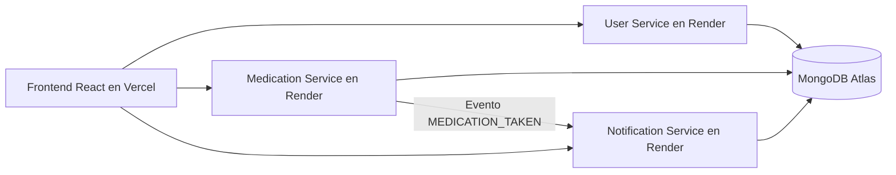
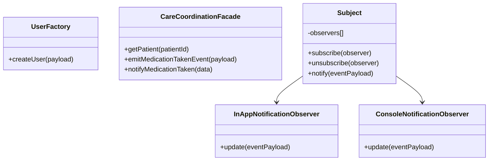
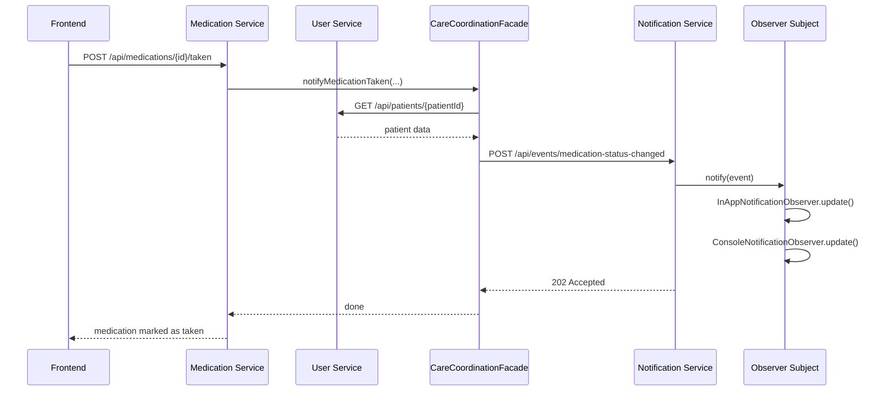

# Arquitectura del Sistema

## Resumen

Sistema distribuido con 3 microservicios Node.js + Express, frontend React y MongoDB Atlas.

- `user-service`: gestión de pacientes/cuidadores
- `medication-service`: gestión de medicamentos y agenda diaria
- `notification-service`: procesamiento de eventos y notificaciones
- Frontend React: interfaz de operación para el cuidador

## Diagrama de Arquitectura (Mermaid)

## Diagrama de Clases (Mermaid)

## Diagrama de Secuencia (Flujo de Notificación)

## Decisiones de Arquitectura

1. **Microservicios**: separan dominios (`usuarios`, `medicación`, `notificaciones`) y simplifican despliegue independiente.
2. **REST + eventos**: REST para CRUD síncrono; evento para reacción desacoplada en notificaciones.
3. **MongoDB Atlas**: bajo costo, esquema flexible y rápido para prototipo.

## Trade-offs

- Mayor complejidad operativa vs monolito.
- Comunicación HTTP entre servicios añade latencia, pero mejora separación de responsabilidades.
- Eventing sin broker es simple y barato, pero no duradero ante caídas.

## Evolución recomendada

- Incorporar broker (RabbitMQ/Kafka/SQS) para entrega garantizada.
- Añadir auth (JWT + API Gateway).
- Trazabilidad distribuida (OpenTelemetry).
